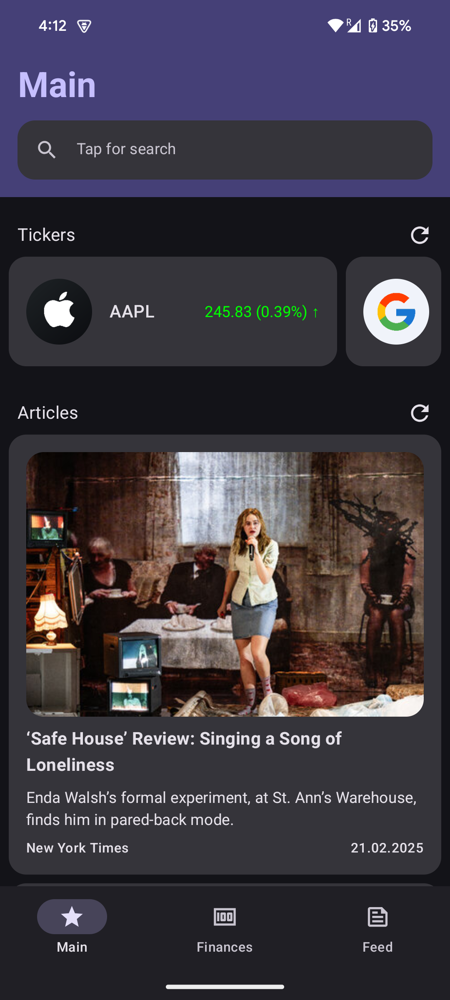
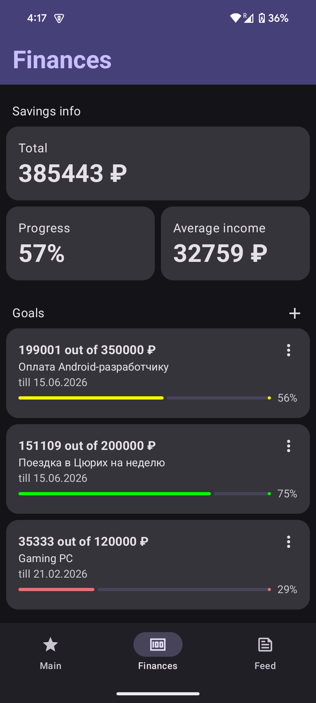

# SuperTracker
Приложение для тех, кто интересуется деньгами и всем, что с этим связано

<div align="center">




</div>

> README будет переписано вместе с кастрированным `feature-feed` модулем

## Функциональность
### Базовый функционал
- Просмотр мировых новостей и информации по рынку ценных бумаг, а также их поиск
- Финансовый помощник управления сбережениями для откладывания денег на цели с отслеживанием их движения
- ...
### Доработки сверх базового
- Шиммер во время загрузки данных
- Асинхронное анимированное отображение информации во всём приложении
- В финансовом помощнике: переводы между счетами, снятие/пополнение
- Довольно быстрый поиск новостей и ценных бумаг

## Технологии и их обоснование
- UI написан с использованием Jetpack Compose. Данный фреймворк (который, к тому же, самый актуальный atm) позволяет писать декларативный код, что упрощает его понимание и поддержку, в отличие от императивного, который используется в XML
- Для работы с сетью используется Retrofit + OkHttp (Interceptors). Retrofit подходит лучше, так как Ktor Client актуален в случаях сложных API (например, WebSockets), но здесь в этом нет необходимости.
- Для асинхронных запросов используется Kotlin Coroutines. С помощью них обеспечивается реализация одной из доп. фич - асинхронное отображение информации. Неактуальной альтернативой является RxJava
- Для хранения данных используется Room. Реализация кейса не содержит таких данных, которые могли бы с лёгкостью храниться в SharedPreferences или DataStore, поэтому был использован Room - единственная адекватная абстракция над SQLite
- Для сериализации данных используется Kotlinx Serialization. Альтернативами являются Gson и Moshi, но Kotlinx Serialization более удобен в контексте Kotlin, так как интегрирован в язык
- Для внедрения зависимостей используется Koin. Альтернативами являются Dagger/Hilt и банальное объявление и внедрение всех зависимостей в классе Application. Koin больше всего удобен в данном кейсе, так как его проще настраивать и он не требует кодогенерации, в отличие от Dagger/Hilt
- Для навигации используется Jetpack Navigation. Это самое обычное решение для навигации в приложении. Альтернативами являются Jetpack Destinations, который лишён актуальной документации, а также Decompose, который пусть и является мощным инструментом, но больше всего подходит для многоплатформенных проектов
- Для загрузки изображений используется Coil. Альтернативами являются Picasso и Glide.  Coil был выбран, так как он более современный, лёгкий и оптимизирован для работы с Jetpack Compose, в отличие от ранее сказанных библиотек, которые ориентированы на Android Views
- Для использования (получения) API-ключей из файла `local.properties` используется Gradle Secrets Plugin. Альтернативами являются простое объявление констант в коде или использование `BuildConfig` класса, но данный плагин удобен и безопасен для работы с API-ключами, так как не оставляет их в открытом виде в коде, в отличие от названных альтернатив

## Архитектурное решение
В приложении используется Clean Architecture и паттерн feature modules, а также MVVM
### Clean Architecture
- Разделяет код на независимые слои
- Упрощает тестирование - можно мокать зависимости при надобности
- Компоненты становятся легкозаменяемыми и избавляют от нужды лопатить всё приложение
### Feature modules
- Каждая фича - отдельный модуль. Плюс к масштабируемости и удобству разработки
- При изменении одной фичи не пересобирается весь проект
### MVVM
- Разделяет логику отображения и бизнес-логику (делает UI dumb)
### Структура проекта
- `app` - входная точка приложения, в которой конфигурируются фреймворки Koin и Jetpack Navigation
- `common` - общие API, репозитории, зависимости (DI), базовый класс для use-case и UI-компоненты (shimmer и Slot API)
- `feature-home` - модуль с главным экраном, содержащий информацию по рынку ценных бумаг и мировые новости
- `feature-search` - модуль с экраном поиска той же информации, что и на главном экране
- `feature-finances` - модуль, в котором реализован финансовый помощник для управления сбережениями и целями
- `feature-feed` - модуль с экраном ленты новостей, aka заготовка под соцсеть

## Сборка
- Получите API-ключи [Finnhub](https://finnhub.io/register) и [New York Times](https://developer.nytimes.com/get-started)
- Склонируйте репозиторий
```shell
git clone https://gitlab.prodcontest.ru/2025-final-projects-mobile/mvnh
```
- Перейдите в корень проекта
```shell
cd mvnh
```
- Создайте файл `local.properties` в корне проекта и запишите в него локацию SDK и API-ключи
```properties
sdk.dir=/home/user/Android/Sdk
NYTIMES_API_KEY=михаил кузнецов
FINNHUB_API_KEY=я ваш фанат
```
- Запустите сборку
```shell
./gradlew assembleRelease
```
